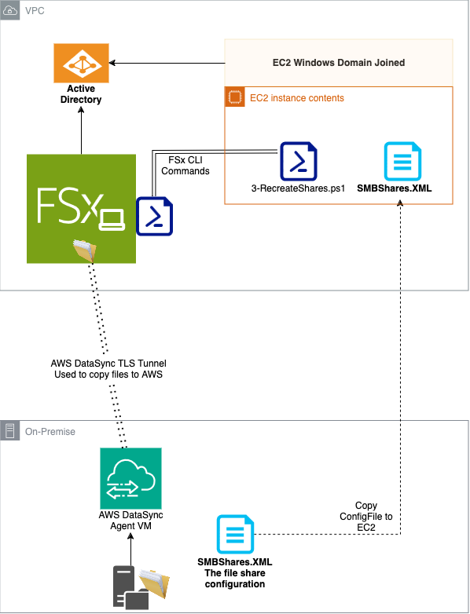
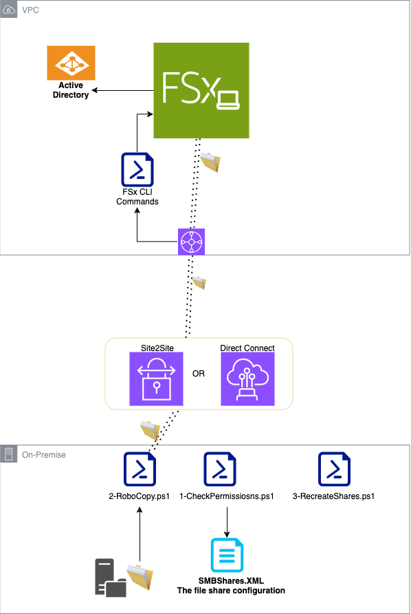
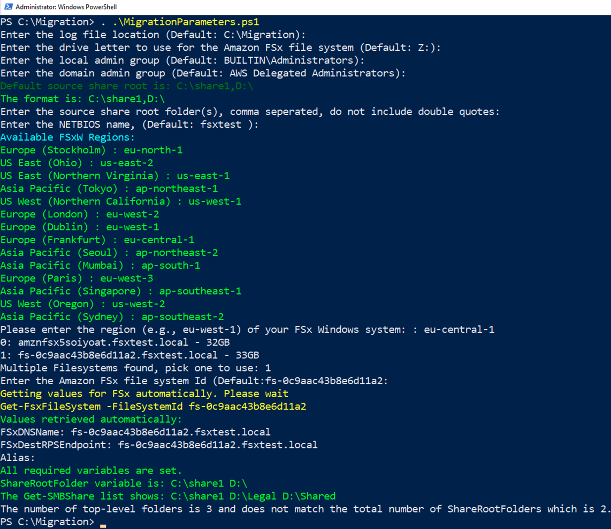
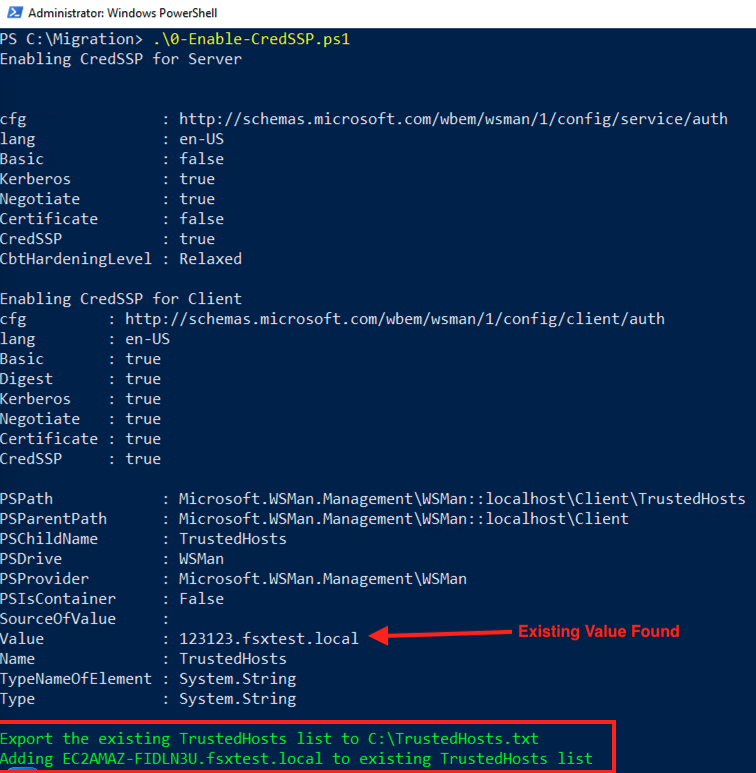
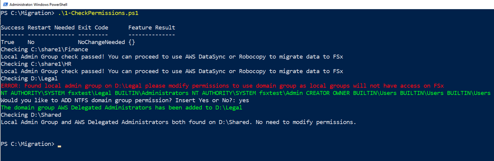
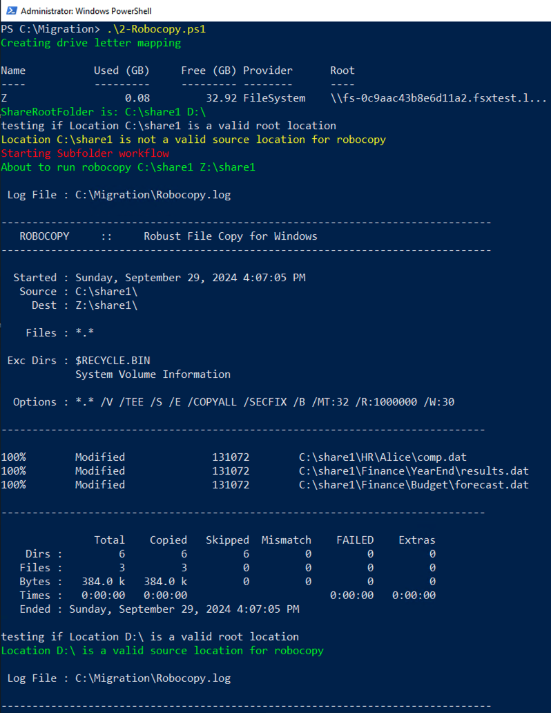
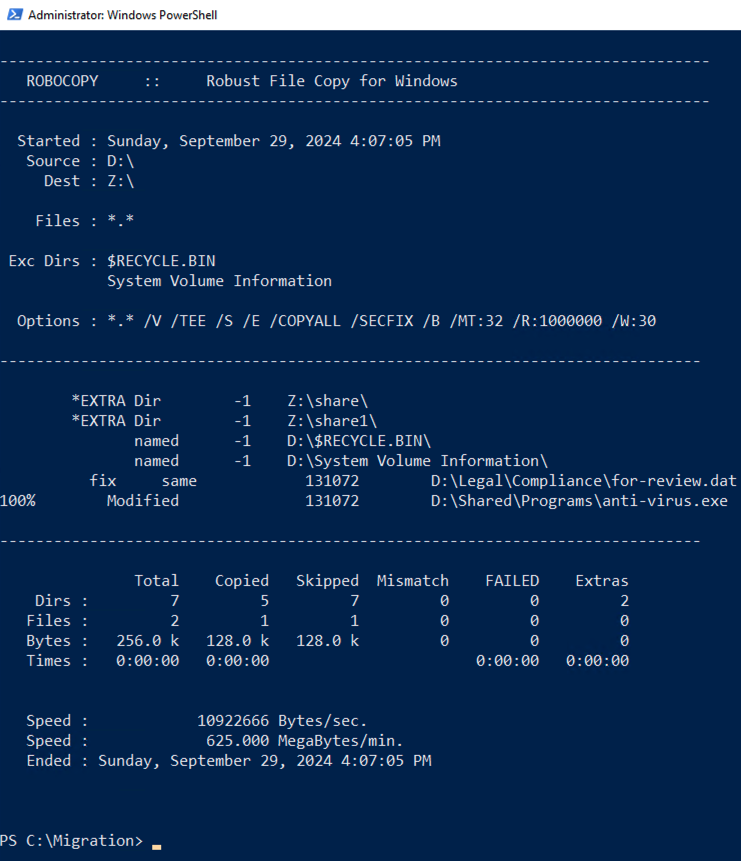
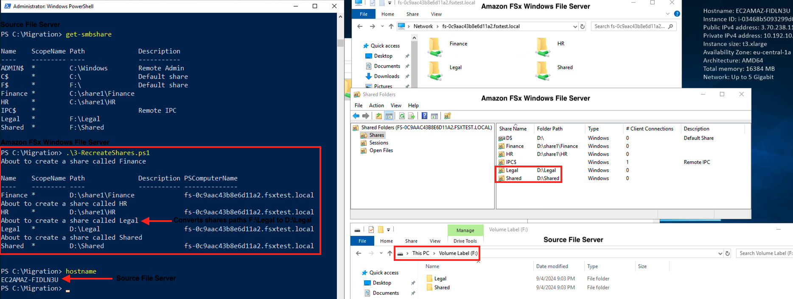

## Migrate Windows File Servers to Amazon FSx for Windows File Server

This repository contains a set of PowerShell scripts to assist in the migration of a Windows file server to Amazon FSx for Windows File Server.
Please view blog post for more details:

https://aws.amazon.com/blogs/storage/migration-to-amazon-fsx-for-windows-file-server-cost-optimization-strategies-and-automation/

## The migration process involves the following steps:

    Enabling CredSSP (Credential Security Support Provider) on the source file server.
    Checking the NTFS and SMB share permissions on the source file server and addressing any issues.
    Copying the data from the source file server to the FSx instance using Robocopy.
    Recreating the file shares on the FSx instance using PowerShell remoting.
    (Optional) Removing the existing Service Principal Names (SPNs) from the source file server's Active Directory computer object and adding the new SPNs to the FSx instance's computer object.
    (Optional) Recreating the DNS CNAME records for the file server aliases and linking them to the FSx instance's DNS name.
    Disabling the CredSSP configuration after the migration is complete.

## Prerequisites

1. PowerShell version 5.1 or later is required to run these scripts
1. Active Directory module for PowerShell (1-Check-Permissions.ps1 script installs this if not found)
1. Appropriate permissions to manage file shares, Active Directory objects, and DNS records
   
### Connectivity: No VPN to AWS VPC
   
1. AWS DataSync Agent to transfer the data from on premise to Amazon FSx Windows: https://aws.amazon.com/blogs/storage/migrate-to-amazon-fsx-for-windows-file-server-using-aws-datasync/
2. Run 1-CheckPermissions.ps1 on source file server to create an XML file with all share information. (Path: $LogLocation\SmbShares.xml)
3. Copy that XML file to a domain joined EC2 Windows instance hosted in the same subnet as FSx Windows.
4. Download the code repo or zip file to the EC2 Windows instance and run MigrationParameters.ps1 then RecreateShares.ps1 file to rebuild the shares on FSx Windows.

    

6. Run any other scripts you may need (Remove-AddSPN,Alias-CNAME etc...)

### Connectivity: VPN to AWS VPC

1. If using Robocopy: 
    1. A drive mapping to destination Amazon FSx Windows D: drive. Open powershell as Administrator, and run: `net use Z: \\FSxDNSName\D$`  
    1. The source file server needs to reach Amazon FSx Windows on port 445 for SMB and port 5985 in order to establish a Remote PowerShell session.
    1. See https://docs.aws.amazon.com/fsx/latest/WindowsGuide/cant-access-rps.html for details
1. (Optional) If source file server is hosted on an EC2 instance, which has the AWS PowerShell Tools pre-installed. You can attach an IAM role that has the "fsx:DescribeFileSystems" permissions. The script will auto detect FSx DNS name, and endpoint details
   

## Note

The FSx for Windows file system by default creates a demo share named "Share", if your source file server has a share folder called "Share" you would need to either manually delete the one that exists on FSx Windows first before migrating or rename the on premise share to something else.

## Usage

Clone the repository to your local machine. Alternatively download the repository as a zip file.
Review and update the configuration parameters in the MigrationParameters.ps1 file.

## Note

There is a double dot . . in the dot source command

### Step 1:
Dot Source the MigrationParameters.ps1 file to load all the values into memory:

` . .\MigrationParameters.ps1 `
    

### Step 2:

Optional scripts, run if using CNAME\Alias: 0-Enable-CredSSP.ps1, 4-Remove-Add-SPN.ps1, 5-Alias-CNAME.ps1, 6-Disable-CredSSP.ps1. 

Run the scripts that apply to your environment in the following order:
 
    
1. ` .\0-Enable-CredSSP.ps1 ` (Optional)      
    

1. ` .\1-CheckPermissions.ps1 ` (Required)
    

1. ` .\2-Robocopy.ps1 ` (Optional - Run if not using AWS DataSync)

    

    

1. ` .\3-RecreateShares.ps1 ` (Required)
    
1. ` .\4-Remove-Add-SPN.ps1 ` (Optional)
1. ` .\5-Alias-CNAME.ps1 ` (Optional)
1. ` .\6-Disable-CredSSP.ps1 ` (Optional)

## Logging and Troubleshooting

The scripts use a central log file located at the path specified in the $LogLocation variable. This log file can be used for troubleshooting and reviewing the actions taken during the migration process.
If any issues arise during the migration, refer to the log file and the error messages displayed in the console for more information.

## Disclaimer

These scripts are provided as-is, without warranty of any kind. It is the responsibility of the user to thoroughly test the scripts in a non-production environment before deploying them in a production setting.

## Security

See [CONTRIBUTING](CONTRIBUTING.md#security-issue-notifications) for more information.

## License

This library is licensed under the MIT-0 License. See the LICENSE file.
